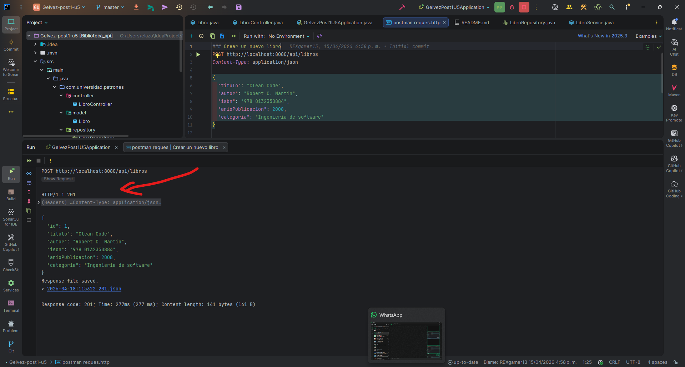
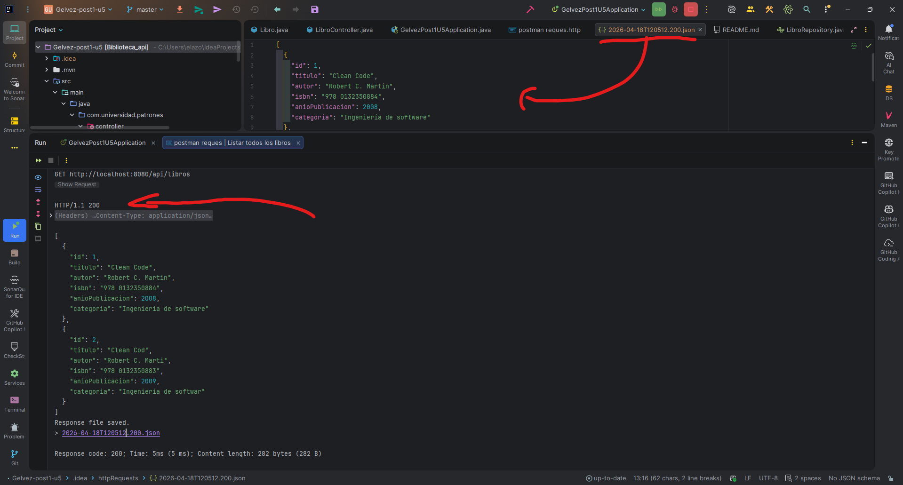
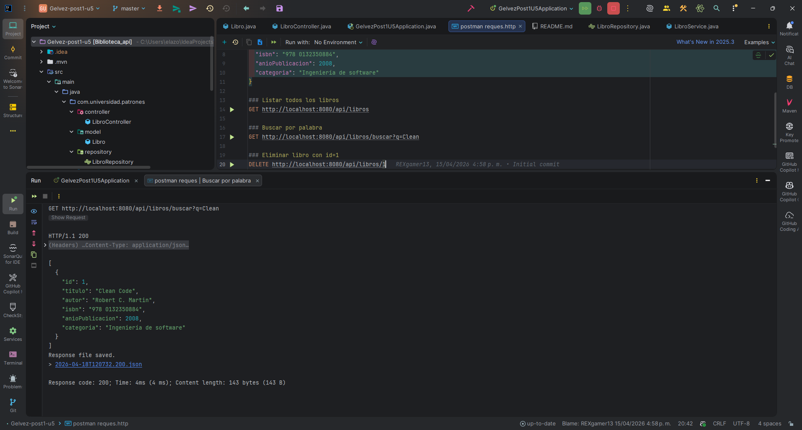
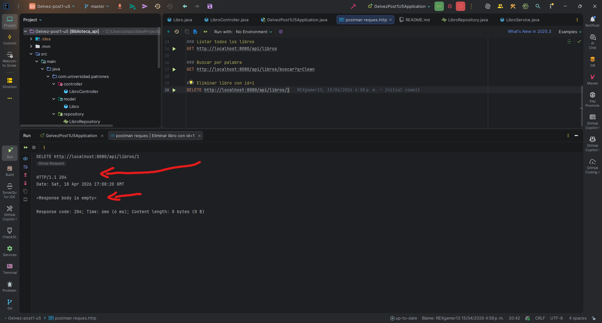

# Proyecto: API de Biblioteca (Gelvez-post1-u5)

Este proyecto es una API RESTful desarrollada en Java con **Spring Boot**. Permite la gestión de libros en una biblioteca virtual y cuenta con una arquitectura basada en capas. La estructura del proyecto ya se encuentra corregida y se ejecuta correctamente.

## Arquitectura

El proyecto está organizado en las siguientes capas (patrón MVC):
- **Model / Entidades**: Representan la estructura de datos que se guarda en la base de datos (por ejemplo, la clase `Libro`).
- **Repository**: Define las interfaces (extienden de `JpaRepository`) que proporcionan la abstracción necesaria para interactuar con la base de datos de manera automática.
- **Service**: Contiene la lógica de negocio. Es el intermediario entre los controladores y los repositorios, realizando operaciones sobre los datos, como guardados o validaciones.
- **Controller**: Expone la API REST gestionada a través de anotaciones de Spring (como `@RestController` y `@RequestMapping`). Recibe las solicitudes HTTP, delega la lógica al servicio adecuado y devuelve la respuesta correspondiente.

## Dependencias Necesarias

El proyecto utiliza **Maven** como gestor de dependencias. Las principales dependencias configuradas en el `pom.xml` son:
- **Spring Boot Starter Web**: Soporte para el desarrollo de la API REST y contenedor embebido Tomcat.
- **Spring Boot Starter Data JPA**: Soporte para la persistencia de datos mediante Hibernate.
- **Spring Boot Starter Validation**: Integración con Bean Validation para la declaración de reglas de validación en las entidades.
- **H2 Database**: Base de datos en memoria para pruebas y desarrollo.
- **Lombok**: Generador automático de código (getters, setters, constructores) para mantener un código limpio.

## Cómo ejecutar el proyecto

1. **Requisitos Previos:** Asegúrate de tener instalado Java 17 y Maven, o usa el wrapper de Maven incluido en el proyecto instalado en tu equipo.
2. **Construir el proyecto:**
   Abre una terminal en la raíz del proyecto y ejecuta:
   ```bash
   ./mvnw clean install
   ```
   (Para Windows, puedes usar `mvnw.cmd clean install`)
3. **Ejecutar la aplicación:**
   Una vez construido, inicia la aplicación mediante:
   ```bash
   ./mvnw spring-boot:run
   ```
   (Para Windows: `mvnw.cmd spring-boot:run`)
4. La aplicación se ejecutará en `http://localhost:8080`. Se creará automáticamente la base de datos H2 en memoria y se puede acceder a su consola en `http://localhost:8080/h2-console`.

---

## Endpoints Disponibles y Verificación

Para la validación de los endpoints se utilizaron dos métodos:
1. Comandos `curl` en la terminal.
2. El archivo `requests.http` incluido en la raíz del proyecto, el cual permite probar los endpoints de manera visual y directa desde el entorno de desarrollo (JetBrains/IntelliJ IDEA).

El contenido de este archivo `requests.http` es el siguiente, permitiendo ejecutar directamente las consultas:
```http
### Crear un libro
POST http://localhost:8080/api/libros
Content-Type: application/json

{
  "titulo": "Clean Code",
  "autor": "Robert C. Martin",
  "isbn": "978 0132350884",
  "anioPublicacion": 2008,
  "categoria": "Ingeniería de software"
}

### Listar todos los libros
GET http://localhost:8080/api/libros

### Buscar por palabra
GET http://localhost:8080/api/libros/buscar?q=Clean

### Eliminar libro con id=1
DELETE http://localhost:8080/api/libros/1
```

A continuación se detallan los comandos `curl` solicitados para la verificación manual:

### 1. Crear un Libro (POST)
- **Endpoint:** `POST /api/libros`
- **Comando cURL para verificar:**
  ```bash
  curl -X POST http://localhost:8080/api/libros \
       -H "Content-Type: application/json" \
       -d '{"titulo":"Clean Code","autor":"Robert C. Martin","isbn":"9780132350884","anioPublicacion":2008,"categoria":"Ingeniería de software"}'
  ```

### 2. Listar todos los libros (GET)
- **Endpoint:** `GET /api/libros`
- **Comando cURL para verificar:**
  ```bash
  curl http://localhost:8080/api/libros 
  ```

### 3. Buscar por palabra (GET)
- **Endpoint:** `GET /api/libros/buscar`
- **Parámetro:** `q` (La palabra a buscar en título o autor).
- **Comando cURL para verificar:**
  ```bash
  curl "http://localhost:8080/api/libros/buscar?q=Clean" 
  ```

### 4. Eliminar libro con id=1 (DELETE)
- **Endpoint:** `DELETE /api/libros/{id}`
- **Parámetros:** ID del libro en la URL.
- **Comando cURL para verificar:**
  ```bash
  curl -X DELETE http://localhost:8080/api/libros/1
  ```

### Otros endpoints (Opcionales)
- **Obtener libro por ID:** `GET /api/libros/{id}`
- **Modificar libro:** `PUT /api/libros/{id}` (Debes proveer un JSON completo con los datos modificados del libro).

### Evidencia Fotográfica
A continuación se muestran capturas de pantalla de la ejecución de los comandos `curl` y del archivo `requests.http` en IntelliJ IDEA, confirmando que los endpoints funcionan correctamente:







